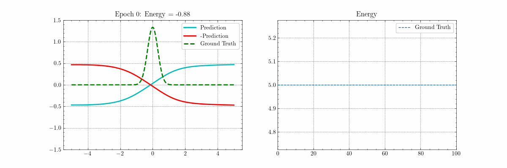

# SE-PINN

This is the official GitHub repository for _Solving the Schrödinger Equation via Physics-Informed Machine Learning_.

The research was in collaboration with Alexander Ahrens and under the supervision of Prof. Ipek Oguz (https://engineering.vanderbilt.edu/bio/ipek-oguz) at Vanderbilt University.

**Figure: Animation of the Predicted Energy Eigenvector (Left) and the Predicted Energy Eigenvalue (Right)**

## Usage

- Open the notebook interactively via Google Colab: https://colab.research.google.com/github/Tiger-Du/SE-PINN/blob/main/SE-PINN.ipynb.

- Open the notebook non-interactively via GitHub: https://github.com/Tiger-Du/SE-PINN/blob/main/SE-PINN.ipynb.

## Background

The Schrödinger equation is the central equation of quantum mechanics.
