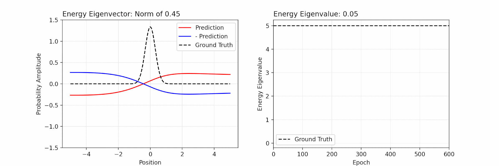
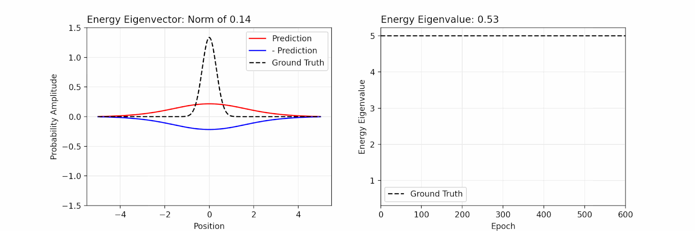

### SE-PINN

This is the official repository for _Solving the Schrödinger Equation via Physics-Informed Machine Learning_.

Here a physics-informed neural network is developed and evaluated for solving the Schrödinger equation of quantum mechanics. The model is constrained to predict quantum-mechanical states that respect the physical properties of symmetry, normality, and orthogonality as well as information from the Schrödinger equation itself -- all via a custom __loss function__ and a custom __architectural layer__ in PyTorch. In addition, the model learns not through supervised learning but through __reinforcement learning (RL)__ from feedback from the Schrödinger equation.

This research was in collaboration with Alexander Ahrens and under the supervision of Prof. Ipek Oguz (https://engineering.vanderbilt.edu/bio/ipek-oguz) at Vanderbilt University.

---

### Demonstration

__Figure 1__ and __Figure 2__ are animations of the ground state (_left_) and the energy of the ground state (_right_) that are predicted by the model as it trains. The physical system is the quantum harmonic oscillator, which is used to model diatomic molecules such as molecules of hydrogen halides, nitrogen, and oxygen. The enforcement of exact symmetry on the prediction of the ground state via a particular architectural layer -- a "hub layer" -- improves the convergence of the model to the correct energy.

| **Figure 1**: No Enforcement of Exact Symmetry via Architecture |
| --- |
|  |

| **Figure 2**: Enforcement of Exact Symmetry via Architecture |
| --- |
|  |

---

### Usage

__Installation__:

```
pip install sepinn
```

__Usage__:

```
from sepinn.wrappedpinn import WrappedPINN

model = WrappedPINN(...)

model.train(...)
```

---

### Documentation

__Google Colab__ (Interactive)

https://colab.research.google.com/github/Tiger-Du/SE-PINN/blob/main/docs/quantum_harmonic_oscillator.ipynb

__nbviewer__ (Non-interactive)

https://nbviewer.org/github/Tiger-Du/SE-PINN/blob/main/docs/quantum_harmonic_oscillator.ipynb

---

### Citation

```
@techreport{DuAhrensOguz2023,
  author={Du, Tiger and Ahrens, Alexander and Oguz, Ipek},
  institution={Vanderbilt University},
  title={Solving the Schrodinger Equation via Physics-Informed Machine Learning},
  year={2023}
}
```

---

### License

SE-PINN is under the GPL-3.0 license as specified in [LICENSE](LICENSE).
